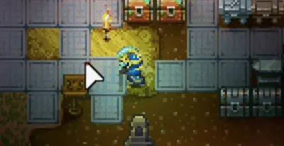

# No-Break Zone

> A Core Keeper mod for anyone tired of breaking their own stuff. Switch on a pylon and everything around it stays in one piece. Bombs or pickaxes, doesn't matter.



## What's inside

| | | |
| --- | --- | --- |
|  | **No Break Pylon** | Place it and press **E** to switch it on. While it's on, nothing around it breaks, and neither does the pylon. Press **E** again to switch it off. |
|  | **Pylon Workbench** | Makes the pylon, the lens and the remote. Crafted at the Automation Table. |
|  | **Pylon Lens** | Hold it to see how far each pylon reaches. |
|  | **Pylon Remote** | Right-click a pylon from a distance to switch it on or off. Handy when you've walled yourself away from one. |

## Install

Put the built `NoBreakZone` folder into the game's mods folder and restart the game.

```
<Core Keeper>/CoreKeeper_Data/StreamingAssets/Mods/
```

On a dedicated server it goes in `CoreKeeperServer_Data/StreamingAssets/Mods/` instead. In multiplayer, the server and every player need the mod. Anyone without it gets a notice before joining.

## Development

This repository is only the mod folder. It lives inside the Core Keeper Mod SDK, which is the Unity project.

```
git clone https://github.com/Pugstorm/CoreKeeperModSDK
git clone https://github.com/LeeShinYeoung/no-break-zone CoreKeeperModSDK/Assets/NoBreakZone
```

Open the SDK folder in Unity Hub. When it installs the editor, turn on **Linux Build Support (Mono)**.

**Build (Windows)**

Close the Unity editor and run the script below. The built mod goes straight into the game's Mods folder.

```
powershell -File Editor/build.ps1
```

The default paths sit at the top of the script. If yours are different, pass `-Unity`, `-ProjectPath` and `-ExportPath`.

**Making changes**

`Prefabs/`, `Textures/` and `Data/` are generated by `Editor/genassets.py`. Don't edit them by hand. Change the script and run it again. These checks run without Unity:

```
python3 Editor/genassets.py --check
python3 Editor/preflight.py
```

## License

MIT. See [LICENSE.md](LICENSE.md).
